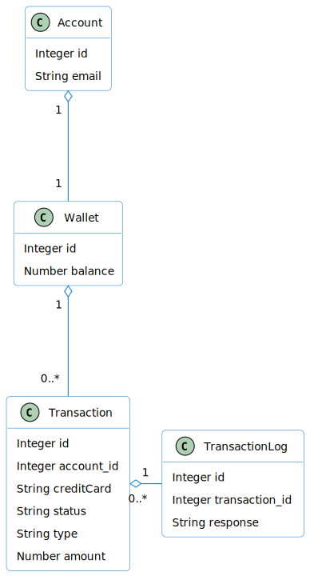

# Wallet Service Application

## Project Description
Challenge for a wallet handle:
- Get a wallet by `ìd`.
- TopUp money in this same wallet charging a credit card via third party provider (mocked stripe).
- We have not added the Log entity. Micrometer, Prometheus & ELK + Grafana could be an option to improve observability & monitoring. 
- This solution could be improved:
  - Using Webflux (reactive) as non blocking solution.
  - using a Message Broker with:
    - CDC (Change Data Capture - Debezium) as Outbox Pattern 
    - Coreography & DLQ's to recover the system.

### Assumptions
- When the account is created, the wallet is available.
- Every account has only one wallet. It means the `ìd` of the Account and the `ìd` of the wallet are equal.
- Explanation of operations:
  - Transactions
    - TOPUP move money from CreditCard to PlayTomic-Wallet. Wallet increased.
    - REFUND move money from PlayTomic-Wallet to CreditCard. Wallet decreased.
  - Store-Operations
    - PURCHASE products (tennis balls) and decrease the balance of the wallet. CreditCard is not needed.
    - RETURN products (tennis balls) and increase the balance of the wallet. CreditCard is not needed.

- To force the balance is always `>=0` we can apply this `CONSTRAINT` to the database definition: \
`alter table wallet add constraint IF NOT EXISTS balance_nonnegative check (balance >= 0);`


## Implementations
The wallet charging use case is implemented in the class `CreateChargeTransactionInteractor`

## Endpoints
host: `http://localhost:8090`

### Create account:
`POST /v1/accounts`\
body:
```
{
  "alias": "Jandrinet",
  "email": "alex.vall.mainou@gmail.com",
  "first_name": "alex",
  "last_name": "vall"
}
```
### Get accounts:
`GET /v1/accounts`

### Get the wallet:
`GET /v1/wallets/{account_id}`

### Create transaction:
`POST /v1/transactions`\
\
Body:
```
{
  "wallet_id" : "",
  "credit_card": "4242424242424242",
  "amount": 100.00,
  "type": "TOPUP"
}
```

## Components
### Architecture
- The hexagonal architecture applied in this micro is:\
  
- The components applied in this micro are:\
  - `openapi` Api-specification following standards. The `dto's` & the `controller interface` are autogenerated on build phase.
  - `app` Micro-service implementation.
    
- The @Interactor (decorator) is useful to avoid the Spring Framework dependencies in the Application layer.

### Domain model
- We assume the `Account id` is the same than the `Wallet id`.
- The global domain model (tenant is not reflected) managed in this micro is:\
  

### (UML) Sequence diagram
- We shoe here the sequence diagram for the use case to charge the Credit Card & update the wallet .
  


### Database
- The database model of `wallet` managed in this micro is:\
  
- The best option to create the database should be use `liquibase` (versioned & incremental schema modifications) but for this challenge we have used `hibernate` feature. \
- To connect to H2 database console you can use `http://localhost:8080/h2-console/` but then you must remove (or comment) `org.zalando:logbook-spring-boot-starter` dependency from `infrastructure:rest-api` module .
Then you can introduce these connection parameters:
````
JDBC URL:  jdbc:h2:mem:testdb;DB_CLOSE_ON_EXIT=FALSE;IGNORECASE=TRUE
User Name: sa
````
 
- There is sample data (`data.sql) uploaded when app starts.

## Compile & execute unit/integration test
From cli run this command
````
./mvnw clean verify -T 2
````
Missing: create Git action to validate Pull Request (pull review).


## Package & Run the Project
### from your local JVM
from CLI run this command to create the package:
````
./mvnw clean package -T 2
````  

Then to run:
````./mvnw spring-boot:run````

## Testing
- The integration test is implemented into the class `WalletControllerIT`.
- Once the micro is running we can run a manual test using:
  - From `ìntellij` using `http client` feature (plugin). Go to folder `./addons/api-testing/http-samples` & click on the file (`http-requests.http`) with extension `http`.
  - From `postman` import the collection `./addons/api-testing/postman/Playtomic-Challenge.postman_collection.json`. 